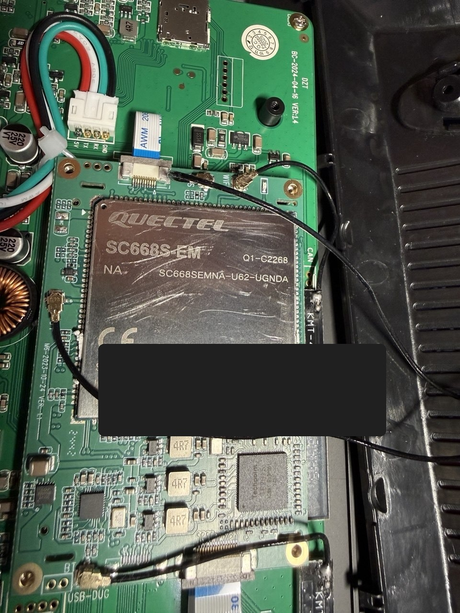

# Восстановление сотовой связи Android-магнитолы с Quectel SC668S-EM

> Репозиторий содержит документацию и проверочный скрипт. Фирменные образы
> Carlinkit/Quectel здесь не распространяются: используйте образ из законно
> доступной совместимой заводской прошивки и обязательно сверяйте SHA-256.

Готовый архив с документацией и скриптом доступен на странице
[последнего релиза](https://github.com/BulbuLbul86/quectel-sc668s-car-head-unit-cellular-fix/releases/latest).

## Проверенное устройство и источник образа

Целевым устройством была автомобильная Android-магнитола с установленным
smart-модулем Quectel:

```text
SC668S-EM
SC668SEMNA-U62-UGNDA
```



Рабочий `modem.img` взят **не из прошивки этой магнитолы**, а из полной
прошивки от **04.07.2024 для Carlinkit Tbox Plus 668 QCM6125**. Прошивка
Carlinkit была предварительно распакована, после чего из неё извлечён раздел
`modem.img`.

Таким образом:

- прошиваемое устройство: автомобильная Android-магнитола с Quectel SC668S-EM;
- источник совместимого модема: распакованная прошивка Carlinkit Tbox Plus 668
  QCM6125 от 04.07.2024;
- проверенный извлечённый файл: `payload_dumper/output/modem.img`.

## Полный downgrade Android не требуется

В проверенном случае не потребовалось откатывать или полностью перепрошивать
Android-магнитолу. Причина отказа регистрации находилась в прошивке
радиомодема, поэтому достаточно было заменить **только активный раздел
`modem_a`** совместимым более ранним `modem.img`.

Android, приложения, пользовательские данные, загрузочные разделы и второй
раздел `modem_b` остались без изменений. Это существенно уменьшает риск по
сравнению с полной перепрошивкой устройства.

При этом замена одного `modem.img` допустима только после проверки
совместимости модуля и размеров разделов. Если аппаратная ревизия отличается
или модем после замены не запускается, необходимо восстановить заранее
сохранённый бэкап `modem_a`.

## Симптомы

- SIM-карта определяется, IMEI присутствует.
- Доступные сети и сильный сигнал видны.
- Регистрация во всех сетях отклоняется.
- Несколько заведомо рабочих SIM-карт разных операторов ведут себя одинаково.
- В Android отображается `Emergency calls only`, `DENIED` или `OUT_OF_SERVICE`.

## Причина

В уведомлении `Quectel PCN 2022113001` указано, что новые версии прошивок
некоторых smart-модулей, включая семейства SC668S-EM и SC680A-EM, отключают
регистрацию в сотовых сетях и GNSS в России и Иране.

На проверенной автомобильной магнитоле была установлена версия:

```text
SC668SEMUAR04A01
MPSS.AT.4.3.1-00436-NICOBAR_GEN_PACK-5.75078.2
```

Она видела сети, но отклоняла регистрацию российских SIM-карт.

Проблему устранил откат только активного раздела `modem_a` на совместимый
предыдущий образ модема, собранный 8 декабря 2021 года:

```text
BP01.002(CUSEMUAR04A02)
MPSS.AT.4.3.1-00419-NICOBAR_GEN_PACK-1
```

После перезагрузки устройство зарегистрировалось в LTE, заработали голос,
SMS и мобильные данные.

## Важные предупреждения

- Инструкция проверена на автомобильной Android-магнитоле с модулем
  `Quectel SC668S-EM`, маркировка `SC668SEMNA-U62-UGNDA`, с разблокированным
  загрузчиком и root ADB.
- Carlinkit Tbox Plus 668 QCM6125 является источником донорского `modem.img`,
  а не прошиваемым устройством.
- Не считайте образ универсальным для всех SC668S. Перед прошивкой обязательно
  сравните аппаратную маркировку, размеры разделов и текущую конфигурацию.
- Перед записью обязательно сохраните текущий `modem_a`.
- Не изменяйте `modemst1`, `modemst2`, `fsg`, `fsc` и `persist`: они могут
  содержать уникальные настройки, идентификаторы и радиокалибровки.
- Не прошивайте одновременно `modem_a` и `modem_b`. Нетронутый слот B
  останется дополнительным способом восстановления.
- Все действия выполняются на ваш риск.

## Необходимые файлы

Положите в одну папку:

```text
adb.exe
AdbWinApi.dll
AdbWinUsbApi.dll
flash_modem_prepcn.ps1
modem.img
```

Контрольная сумма проверенного `modem.img`:

```text
SHA256  88602460D786BEB88DD63352A10F22CD53CBA15E8CA2F122144548B96EA97102
Размер  95014912 байт
```

Образ должен быть извлечён из законно доступной полной прошивки Carlinkit
Tbox Plus 668 QCM6125 от 04.07.2024. Не используйте файл с другой контрольной
суммой.

## Автоматическая установка

Подключите устройство к Wi-Fi ADB и запустите PowerShell:

```powershell
Set-ExecutionPolicy -Scope Process Bypass
.\flash_modem_prepcn.ps1 -Device "192.168.101.195:PORT" -Image ".\modem.img"
```

Скрипт:

1. Проверяет ADB root, активный слот A, размер раздела и SHA-256 образа.
2. Сохраняет полный бэкап текущего `modem_a`.
3. Проверяет контрольную сумму бэкапа.
4. Записывает образ только в `modem_a`.
5. Очищает нулями оставшуюся часть раздела.
6. Проверяет SHA-256 всего записанного раздела.
7. Перезагружает устройство.

## Проверка результата

После перезагрузки порт беспроводного ADB может измениться. Подключитесь
заново и выполните:

```powershell
adb connect 192.168.101.195:PORT
adb shell getprop gsm.version.baseband
adb shell getprop gsm.operator.alpha
adb shell getprop gsm.network.type
adb shell "dumpsys telephony.registry | grep -m1 'mServiceState='"
```

Ожидаемый результат:

```text
BP01.002(CUSEMUAR04A02)
LTE
mVoiceRegState=0(IN_SERVICE)
mDataRegState=0(IN_SERVICE)
registrationState=HOME
```

Для проверки мобильного интернета найдите активный интерфейс:

```powershell
adb shell "dumpsys connectivity | grep -F 'MOBILE[LTE]'"
```

Затем проверьте его, например для `rmnet_data1`:

```powershell
adb shell "curl --interface rmnet_data1 -o /dev/null -w '%{http_code}\n' http://connectivitycheck.gstatic.com/generate_204"
```

Ожидаемый HTTP-код: `204`.

## Восстановление исходного модема

Если после прошивки радиомодем не запускается, используйте созданный скриптом
файл `backup-...-modem_a.img`.

Записывать бэкап следует тем же способом, после проверки его размера и
контрольной суммы. Не используйте бэкап от другого устройства.

## Почему `service call iphonesubinfo 1` возвращает ошибку

Команда `service call iphonesubinfo 1` вызывает внутренний Binder-интерфейс
Android. Номера транзакций меняются между версиями Android, а доступ к данным
телефонии ограничен системными разрешениями. Ошибочный `Parcel` не является
признаком неисправной SIM-карты или радиомодема.

## Как не вернуть проблему

Не устанавливайте обновления baseband/modem Quectel без предварительной
проверки версии и наличия региональных ограничений. Обновление Android,
содержащее новый раздел `modem`, может снова отключить регистрацию.
