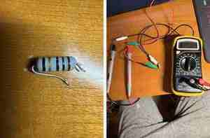
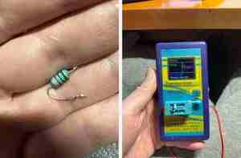

# Ремонт электрического чайника BORK K516

> **Статус: ремонт успешно завершён.** Чайник собран, прошёл контрольные циклы нагрева и кипячения и прекрасно работает.

## Модель и плата

- Модель чайника: **BORK K516**.
- Обозначение платы: семейство `TOP-A460-POWER`.
- На плате читается дата/код около `20180519`.
- Плата подключена непосредственно к сети 220–240 В и содержит неизолированную высоковольтную часть.

## Как возникла неисправность

Изначально внутрь чайника попала вода. После этого чайник включили в сеть, и он **пыхнул**: произошёл электрический пробой с характерным хлопком и следами перегрева.

После вскрытия были обнаружены:

1. Сгоревший высоковольтный электролитический конденсатор `E2`.
2. Прогар и обугливание стеклотекстолита непосредственно под конденсатором.
3. Повреждение защитной маски и контактной площадки в зоне `E2`.
4. Позднее — треснувший серый защитный резистор, ушедший в полный обрыв.
5. Треснувший зелёный низкоомный резистор, который ещё сохранял номинальное сопротивление.

Наиболее вероятно, что вода создала ток утечки или кратковременное замыкание в сетевой части. После подачи питания конденсатор и участок платы получили сильное тепловое повреждение. Обугленный текстолит мог продолжать проводить ток при высоком напряжении даже после замены конденсатора, что создало дополнительную нагрузку на защитные резисторы.

## Фотографии платы и деталей

Фотографии сделаны во время диагностики, до окончательной сборки.

### Общий вид платы с двух сторон


На верхней стороне находятся реле, высоковольтные конденсаторы, варистор, силовые резисторы и катушка. На нижней стороне проверялись пайка, дорожки, диоды и целостность соединений.

### Серый резистор 10 Ом: трещина и полный обрыв



Слева видна поперечная трещина корпуса. Справа мультиметр на диапазоне 200 Ом показывает `1.` — сопротивление выше предела измерения, то есть полный обрыв.

### Конденсатор E2 и прогар текстолита


На фотографиях видны старый конденсатор 47 мкФ 400 В, чёрно-коричневый прогар под ним, повреждённая площадка и обе стороны платы в районе отверстий `E2`.

### Зелёный резистор 4,7 Ом и результат измерения



Компонент-тестер показал 4,50 Ом — электрически номинал ещё находился в допуске, но корпус был треснут, поэтому деталь заменили из соображений надёжности и пожарной безопасности.

## Важное предупреждение по безопасности

На конденсаторе `E2` после сетевого выпрямителя может присутствовать около 310–325 В постоянного напряжения. Заряд может сохраняться и после отключения вилки.

- Измерения сопротивления, диодов и ёмкости выполнять только на отключённой плате.
- Перед пайкой проверять напряжение на `E2` мультиметром.
- Разряжать конденсатор через резистор 47–100 кОм мощностью 1–2 Вт.
- Не разряжать конденсатор отвёрткой и не замыкать выводы напрямую.
- Не касаться платы во время работы: низковольтная логика может быть гальванически связана с сетью.

## Что проверяли и какие результаты получили

### Сводная таблица

| Деталь или цепь | Какой результат считается нормальным | Фактический результат | Решение |
|---|---|---|---|
| Серый резистор | Для номинала 10 Ом: примерно 9,5–10,5 Ом, плюс небольшое сопротивление щупов | `1.` / `OL` на диапазоне 200 Ом; видимая трещина | Обязательная замена |
| Зелёный резистор | Для 4,7 Ом ±5 %: примерно 4,47–4,94 Ом | 4,50 Ом, но корпус треснут | Замена из-за механического и теплового повреждения |
| `E2` | 47 мкФ, 400 В; правильная полярность; без утечки, вздутия и прогара | Старая деталь сгорела; под ней обуглилась плата | Замена конденсатора и восстановление платы |
| X2-конденсатор | Для 0,1 мкФ ±10 %: примерно 90–110 нФ | 95,15 нФ; `Vloss 0,0 %` | Исправен, оставлен |
| Варистор `RV1` | На омметре высокое сопротивление/`OL`; не должен звониться как короткое замыкание | `OL`; тестер увидел около 132 пФ собственной ёмкости | Явного пробоя нет; причиной отказа не признан |
| Диоды `D1–D5` | Проводимость только в одном направлении; обычно 0,4–0,9 В прямо и `OL` обратно | Все диоды прошли проверку | Не заменялись |
| Между площадками снятого резистора | Не должно быть постоянного сопротивления около 0–5 Ом | `OL` в обеих полярностях на диапазоне 200 кОм | Жёсткого короткого замыкания не обнаружено |

## Заменённые детали

### 1. Высоковольтный электролитический конденсатор `E2`

#### Маркировка штатной детали

```text
47 µF
400 V
```

Это полярный электролитический конденсатор после сетевого выпрямителя.

#### Внешние признаки неисправности

- конденсатор вышел из строя после попадания воды и включения чайника;
- произошёл хлопок/«пых»;
- под конденсатором образовался прогар;
- текстолит стал чёрным и коричневым;
- защитная маска и одна из контактных площадок получили повреждение.

#### Нормальные параметры

Для конденсатора 47 мкФ с типичным допуском ±20 % низковольтный тестер обычно должен показать приблизительно **37,6–56,4 мкФ**. Он не должен определяться как короткое замыкание. При этом обычный компонент-тестер не гарантирует отсутствие утечки при рабочих 300+ В.

#### Почему заменили

Решение о замене принято не только из-за номинала, а по факту аварии: конденсатор физически сгорел, а под ним сформировался проводящий угольный след. Повторное использование такой детали невозможно.

#### Установленная замена

```text
47 µF
400 V
```

Установлена деталь с теми же ёмкостью и рабочим напряжением. Допустим качественный аналог 47 мкФ 450 В, 105 °C, если он помещается по габаритам.

Полоса с символами `−` на корпусе обозначает минус. Полярность сверялась с дорожками платы и посадочным местом.

### 2. Серый огнестойкий резистор сетевой цепи

#### Маркировка и номинал

По цветным полосам:

- коричневый — 1;
- чёрный — 0;
- чёрный множитель — ×1;
- золотой — ±5 %.

Номинал:

```text
10 Ом
около 1 Вт
±5 %
flameproof / fusible / safety
```

Дополнительная полоса может обозначать специальную огнестойкую серию производителя.

#### Внешние признаки неисправности

- серый цилиндрический корпус длиной около 10 мм;
- поперечная трещина покрытия;
- мультиметр показывал `OL`;
- резистор полностью перестал проводить ток.

#### Нормальный результат проверки

Исправный резистор 10 Ом должен показать около 10 Ом. При сопротивлении щупов примерно 1–2 Ом на простом мультиметре отображаемое значение могло бы быть около 11–12 Ом.

#### Фактический результат

```text
Диапазон: 200 Ом
Показание: 1. / OL
```

Это означает полный обрыв.

#### Почему заменили

Резистор электрически был неисправен и физически треснул. Кроме ограничения тока, он мог выполнять защитную функцию. Перемычку или обычный маломощный резистор вместо него устанавливать нельзя.

#### Установленная замена

```text
10 Ом
1 Вт
±5 %
огнестойкий / предохранительный
```

### 3. Зелёный низкоомный резистор

#### Номинал

```text
4,7 Ом
около 1 Вт
±5 %
```

Предпочтительно огнестойкое металлооксидное либо подходящее защитное проволочное исполнение.

#### Внешние признаки

- зелёный цилиндрический корпус;
- длина около 9–11 мм;
- трещина защитного покрытия;
- следы теплового или механического воздействия.

#### Нормальный диапазон

Для 4,7 Ом ±5 %:

```text
4,47–4,94 Ом
```

#### Фактический результат

```text
4,50 Ом
```

По сопротивлению деталь ещё была в допуске.

#### Почему всё равно заменили

Трещина означает нарушение огнестойкого покрытия и возможное повреждение внутреннего резистивного элемента. При нагреве сопротивление могло начать меняться, возникнуть искрение или окончательный обрыв. В сетевом приборе оставлять такую деталь небезопасно.

#### Установленная замена

```text
4,7 Ом
1 Вт
±5 %
flameproof / metal-oxide / safety wirewound
```

Подходящий пример семейства — `Yageo KNP-100 ... 4R7` или аналог с теми же параметрами и подходящими размерами.

## Проверенные исправные детали

### Варистор `RV1`

Маркировка:

```text
STE
10D471K
```

Основные признаки:

- металлооксидный варистор диаметром около 10 мм;
- варисторное напряжение около 470 В;
- предназначен для сети до 300 В AC.

Обычный мультиметр показал `OL`, что нормально: при нескольких вольтах исправный варистор почти не проводит. Компонент-тестер определил его как ёмкость около **132 пФ** — это собственная ёмкость MOV, а не признак короткого замыкания.

Полностью проверить напряжение срабатывания 470 В обычным тестером невозможно, но явного пробоя в короткое замыкание не было.

### Сетевой плёночный конденсатор

Маркировка:

```text
0,1 µF
X2
275 VAC
```

Проверка:

```text
Измерено: 95,15 нФ
Vloss: 0,0 %
Отклонение: около −4,9 %
```

Для номинала 100 нФ ±10 % нормальный диапазон составляет примерно 90–110 нФ. Полученные 95,15 нФ находятся в норме, поэтому конденсатор оставили.

### Диоды `D1–D5`

Исправный кремниевый диод обычно показывает 0,4–0,9 В в прямом направлении и `OL` в обратном. Измерение выполнялось непосредственно на плате, поэтому соседние элементы могли немного влиять на результат.

| Диод | Прямое направление | Обратное направление | Оценка |
|---|---:|---:|---|
| D1 | 0,870 В | OL | норма |
| D2 | 0,880 В | OL | норма |
| D3 | 0,870 В | OL | норма |
| D4 | 0,670 В | кратко около 1,5 В, затем OL | норма; краткий импульс связан с зарядом соседнего конденсатора |
| D5 | 0,679 В | OL | норма |

Проводимости в обе стороны и падения около нуля не обнаружено, поэтому диоды не менялись.

## Восстановление прогоревшего участка платы

Обугленный текстолит нельзя оставлять под высоким напряжением. Угольный след может проводить ток при 300+ В, даже если мультиметр на низком напряжении показывает `OL`.

В ходе ремонта:

1. Удалили обугленный и рыхлый материал до чистого стеклотекстолита.
2. Очистили участок от нагара, электролита и остатков флюса.
3. Проверили состояние отверстий и дорожек `E2` с двух сторон.
4. Восстановили повреждённую площадку/соединение до целого участка меди.
5. Исключили припойные мосты и проводящие остатки между высоковольтными цепями.
6. Установили новый `E2` с правильной полярностью.

Покрывать уголь лаком или клеем без удаления прогара нельзя: это не восстанавливает электрическую прочность платы.

## Отключение звукового сигнала BIZZER / BUZZER

Чтобы чайник не раздражал громким пищанием, из разъёма шлейфа был аккуратно извлечён отдельный провод линии:

```text
BIZZER / BUZZER
```

Контакт и провод были изолированы от случайного замыкания. Изменение обратимо: контакт можно вернуть в исходное гнездо разъёма.

После отключения пищалки чайник больше не подаёт звуковые уведомления о включении и завершении работы, но управление, нагрев и автоматическое отключение сохранились.

## Итоговая последовательность ремонта

1. После попадания воды и включения чайник пыхнул.
2. Вскрытие показало сгоревший `E2` 47 мкФ 400 В и прогар текстолита.
3. Конденсатор заменили на 47 мкФ 400 В с соблюдением полярности.
4. Обугленный участок платы очистили и восстановили повреждённое соединение.
5. Серый резистор 10 Ом оказался в полном обрыве и был заменён на огнестойкий 10 Ом 1 Вт.
6. Зелёный резистор показал нормальные 4,50 Ом, но из-за трещины корпуса был заменён на огнестойкий 4,7 Ом 1 Вт.
7. Проверили `D1–D5`, варистор `10D471K` и X2-конденсатор 0,1 мкФ.
8. Из шлейфа извлекли и изолировали провод `BIZZER/BUZZER`.
9. Плату собрали и провели контрольные испытания.

## Контрольные испытания после ремонта

Проверено:

- чайник нормально включается;
- органы управления работают;
- вода нагревается;
- чайник достигает кипения;
- автоматическое отключение срабатывает;
- повторного перегорания резисторов нет;
- запаха гари нет;
- искрения и треска нет;
- аномального нагрева платы не обнаружено;
- контрольные циклы пройдены успешно.

## Итог

**Ремонт BORK K516 завершён успешно. Чайник прошёл тесты и прекрасно работает.**

| Заменённая деталь | Исходный номинал | Установленная замена | Причина |
|---|---|---|---|
| Высоковольтный электролит `E2` | 47 мкФ, 400 В | 47 мкФ, 400 В | Сгорел после попадания воды; под ним образовался прогар |
| Серый защитный резистор | 10 Ом, около 1 Вт, ±5 % | 10 Ом, 1 Вт, flameproof/fusible | Трещина и полный обрыв `OL` |
| Зелёный защитный резистор | 4,7 Ом, около 1 Вт, ±5 % | 4,7 Ом, 1 Вт, flameproof | Сопротивление 4,50 Ом было нормальным, но корпус треснул |

Дополнительно восстановлен прогоревший участок платы возле `E2`, проверены диоды, варистор и X2-конденсатор, а звуковой сигнал отключён извлечением провода `BIZZER/BUZZER` из разъёма шлейфа.